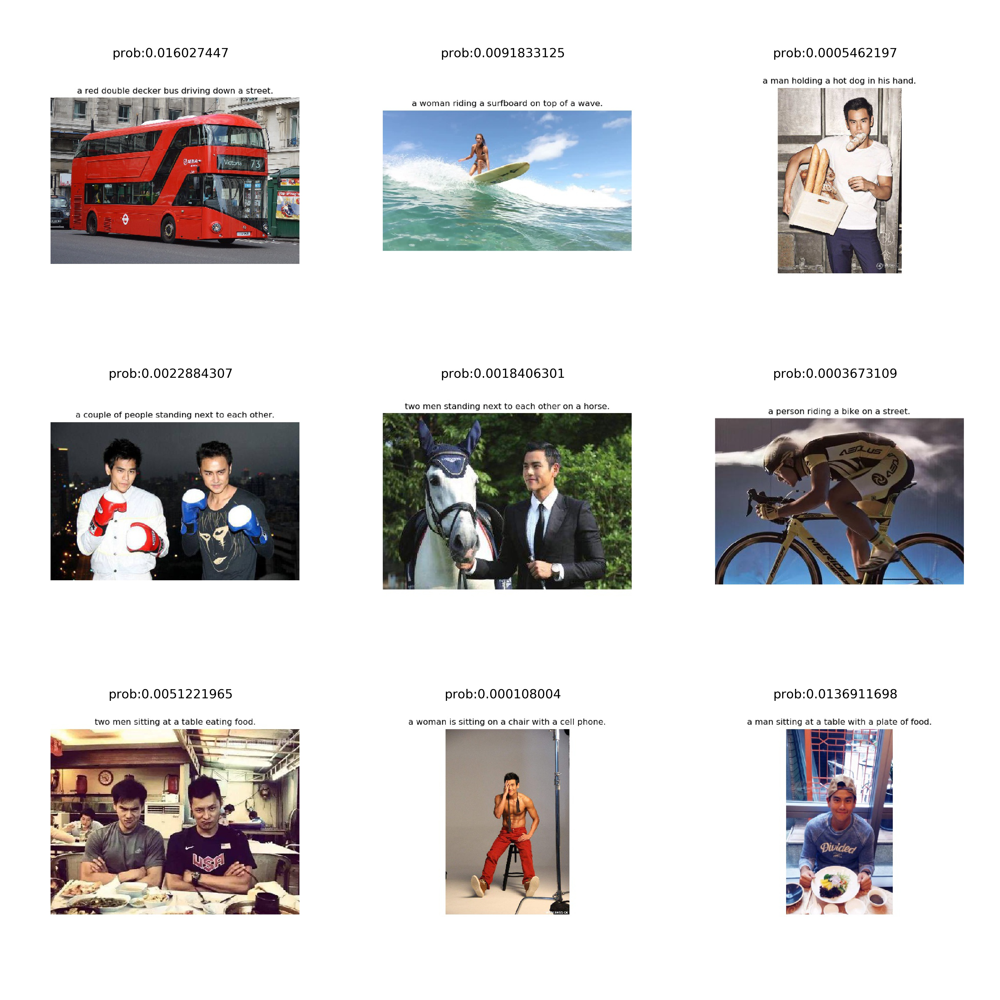

Here are some captions generated by this model:

### Introduction
This is a image caption app baseed on DeepRNN [source code](https://github.com/DeepRNN/image_captioning)(tensorflow) and flask. We provide a local api(http://127.0.0.1:5000) for start the DeepRNN to inference by flask.

> This neural system for image captioning is roughly based on the paper "Show, Attend and Tell: Neural Image Caption Generation with Visual Attention" by Xu et al. (ICML2015). The input is an image, and the output is a sentence describing the content of the image. It uses a convolutional neural network to extract visual features from the image, and uses a LSTM recurrent neural network to decode these features into a sentence. A soft attention mechanism is incorporated to improve the quality of the caption. This project is implemented using the Tensorflow library, and allows end-to-end training of both CNN and RNN parts.

### Usage

* **Requirements**
- python2.7
- nltk==3.3
- numpy==1.15.4
- scikit_image==0.14.0
- tqdm==4.26.0
- matplotlib==2.2.3
- tensorflow_gpu==1.12.0
- pandas==0.23.4
- opencv_python==4.1.0.25
- tensorflow==1.13.1

1. **Install the requirements**

    `pip install -r requirements.txt`

2. **Inference**
* Firstly, start the local api:
    `python main.py`
* Then, start the `jupyter notebook`:
    `jupyter notebook`
* Finally, open the `run.ipynb`:
1. Copy some images to the dir of `test/images` for testing.
2. run the first cell to start inference.
3. run the second cell to visualize the result.
The generated captions will be saved in the folder `test/results`.

### References
* [DeepRNN](https://github.com/DeepRNN/image_captioning)
* [Show, Attend and Tell: Neural Image Caption Generation with Visual Attention](https://arxiv.org/abs/1502.03044). Kelvin Xu, Jimmy Ba, Ryan Kiros, Kyunghyun Cho, Aaron Courville, Ruslan Salakhutdinov, Richard Zemel, Yoshua Bengio. ICML 2015.
* [The original implementation in Theano](https://github.com/kelvinxu/arctic-captions)
* [An earlier implementation in Tensorflow](https://github.com/jazzsaxmafia/show_attend_and_tell.tensorflow)
* [Microsoft COCO dataset](http://mscoco.org/)
